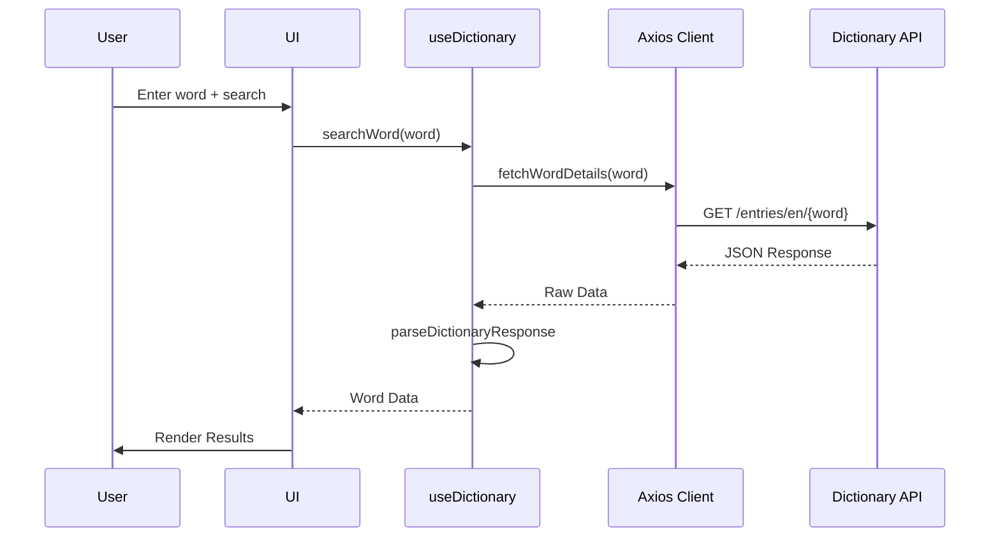

# API Flow

This shows how API requests are structured and handled.

```mermaid
sequenceDiagram

participant User
participant UI
participant Hook as useDictionary
participant API as Axios Client
participant Service as Dictionary API

User->>UI: Enter word + search
UI->>Hook: searchWord(word)
Hook->>API: fetchWordDetails(word)
API->>Service: GET /entries/en/{word}

Service-->>API: JSON Response
API-->>Hook: Raw Data
Hook->>Hook: parseDictionaryResponse
Hook-->>UI: Word Data

UI->>User: Render Results
```