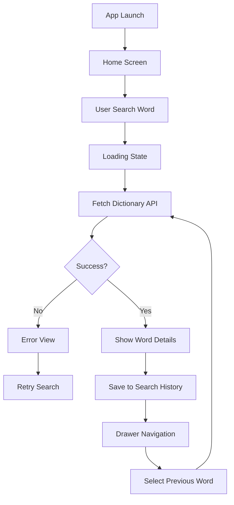

# Application Flow

```mermaid
flowchart TD

Start[App Launch] --> Home[Home Screen]

Home --> Search[User Search Word]
Search --> Loading[Loading State]

Loading --> API[Fetch Dictionary API]

API --> Success{Success?}

Success -->|Yes| Display[Show Word Details]
Success -->|No| Error[Error View]

Error --> Retry[Retry Search]

Display --> History[Save to Search History]

History --> Drawer[Drawer Navigation]
Drawer --> SelectWord[Select Previous Word]

SelectWord --> API
```