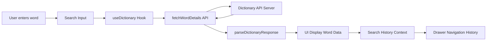

# Data Flow Diagram (DFD)

This diagram shows how data flows from user input to API and back to UI.

```mermaid
flowchart LR

A[User enters word] --> B[Search Input]
B --> C[useDictionary Hook]
C --> D[fetchWordDetails API]
D --> E[Dictionary API Server]

E --> D
D --> F[parseDictionaryResponse]
F --> G[UI Display Word Data]

G --> H[Search History Context]
H --> I[Drawer Navigation History]
```