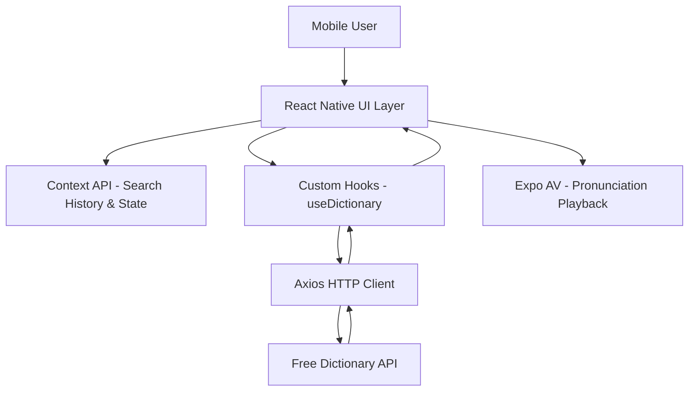

# System Architecture

This document describes the high-level architecture of the Dictionary Mobile App.

```mermaid
flowchart TD

User[Mobile User] --> UI[React Native UI Layer]

UI --> State[Context API - Search History & State]
UI --> Hooks[Custom Hooks - useDictionary]

Hooks --> API[Axios HTTP Client]

API --> ExternalAPI[Free Dictionary API]

ExternalAPI --> API

API --> Hooks
Hooks --> UI

UI --> Audio[Expo AV - Pronunciation Playback]
```